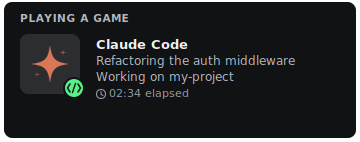
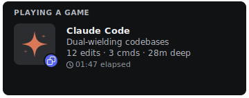
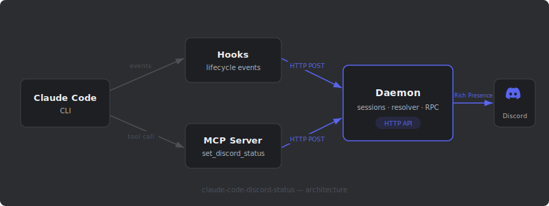

<p align="center">
  
</p>

<p align="center">
  <a href="https://www.npmjs.com/package/claude-code-discord-status"></a>
  <a href="https://github.com/BrunoJurkovic/claude-code-discord-status/actions"></a>
  <a href="https://github.com/BrunoJurkovic/claude-code-discord-status/blob/main/LICENSE"></a>
  
</p>

<p align="center">
  Show what Claude Code is doing as a live Discord Rich Presence card.<br/>
  Hooks into Claude Code's lifecycle events and updates your Discord status in real time.
</p>

---

## Preview

<p align="center">
  
  &nbsp;&nbsp;
  
</p>

<p align="center">
  <b>Single session</b> — shows current action + project name &nbsp;·&nbsp; <b>Multiple sessions</b> — quirky messages + aggregate stats
</p>

## Features

- **Live activity updates** — Your Discord card reflects what Claude is doing right now (editing, searching, running commands, thinking)
- **MCP-powered custom messages** — Claude can set its own status via `set_discord_status`, with a 30-second priority window over hook updates
- **Multi-session support** — Running multiple Claude Code instances? The card escalates with quirky messages and aggregated stats
- **Activity mode detection** — Dominant activity type (coding, terminal, searching, thinking) changes the card icon
- **Rotating tooltips** — Hidden easter eggs on hover, rotating every 5 minutes
- **Auto-reconnect** — Daemon handles Discord RPC disconnects gracefully

## Quick Start

### Prerequisites

- Node.js >= 18
- [jq](https://jqlang.github.io/jq/) (`brew install jq` / `apt install jq`)
- Discord desktop app running
- [Claude Code](https://docs.anthropic.com/en/docs/claude-code) CLI installed

### Setup

```bash
npx claude-code-discord-status setup
```

This will:

1. Create a config at `~/.claude-discord-status/config.json`
2. Register the MCP server with Claude Code
3. Add lifecycle hooks to `~/.claude/settings.json`
4. Start the daemon in the background

That's it. Your Discord status updates automatically whenever you use Claude Code.

## How It Works

<p align="center">
  
</p>

Three components work together:

1. **Hooks** — Bash scripts fired by Claude Code lifecycle events (session start/end, tool use, prompt submit). They POST updates to the daemon's HTTP API.
2. **MCP Server** — An MCP tool (`set_discord_status`) that Claude can call to set a custom, contextual status message — these take priority for 30 seconds.
3. **Daemon** — Background process that holds the Discord RPC connection, tracks all sessions, resolves what to show, and pushes it to Discord.

> See [docs/architecture.md](./docs/architecture.md) for the full deep dive.

## CLI

```bash
npx claude-code-discord-status setup          # Interactive setup wizard
npx claude-code-discord-status status         # Check daemon status and active sessions
npx claude-code-discord-status start -d       # Start daemon in background
npx claude-code-discord-status stop           # Stop the daemon
npx claude-code-discord-status uninstall      # Remove everything
```

## Configuration

Config file: `~/.claude-discord-status/config.json`

| Key | Env Override | Default | Description |
| --- | --- | --- | --- |
| `discordClientId` | `CLAUDE_DISCORD_CLIENT_ID` | `1472915568930848829` | Discord Application Client ID |
| `daemonPort` | `CLAUDE_DISCORD_PORT` | `19452` | Local HTTP server port |

The default client ID works out of the box — it's a public app identifier, not a secret.

> See [docs/setup.md](./docs/setup.md) for all config options, timeouts, and how to use a custom Discord application.

## Multi-Session Fun

When you're running multiple Claude Code sessions, the card gets quirky:

- **2 sessions** — _"Dual-wielding codebases"_, _"Pair programming with myself"_
- **3 sessions** — _"Triple threat detected"_, _"Three-ring circus"_
- **4 sessions** — _"4 parallel universes deep"_, _"One for each brain cell"_
- **5+ sessions** — _"Send help (5 projects)"_, _"Gone feral (6 projects)"_

Plus aggregate stats like `23 edits · 8 cmds · 2h 15m deep` and rotating hover tooltips like _"Technically I'm one Claude in a trenchcoat"_.

> See [docs/multi-session.md](./docs/multi-session.md) for the full message pool and how the resolver works.

## Development

```bash
git clone https://github.com/BrunoJurkovic/claude-code-discord-status.git
cd claude-code-discord-status
npm install
npm run build
npm test
```

See [CONTRIBUTING.md](./CONTRIBUTING.md) for guidelines.

## License

MIT
